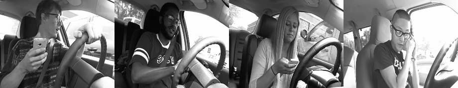
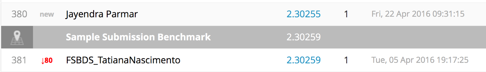
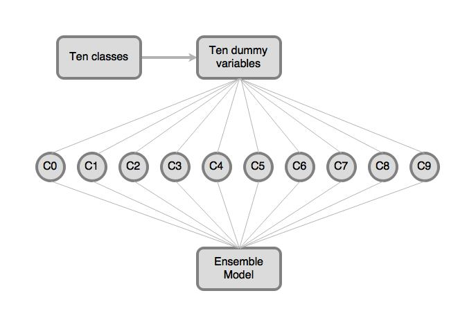
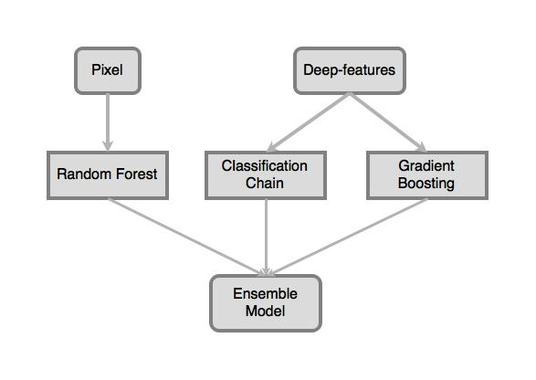

# Project 5: Distracted Driver Detection


<b>Team 4:</b> Haoyang Chen, Jingwei Li, Aoyuan Liao, Qiner Shi.

<br />

#### Project Description

Read [competition details](https://www.kaggle.com/c/state-farm-distracted-driver-detection) on Kaggle.
Our presentation file is [here](presentation.pptx).

According to the CDC motor vehicle safety division, one in five car accidents is caused by a distracted driver. State Farm hopes to improve these alarming statistics, and better insure their customers, by testing whether dashboard cameras can automatically detect drivers engaging in distracted behaviors.

In this project, we extracted features from a dataset of 2D dashboard camera images, and developed a classifer to detect each driver's behavior.



Each of the given driver images was taken in a car with a driver doing something in the car (texting, eating, talking on the phone, makeup, reaching behind, etc).

The 10 classes to predict are:

- c0: safe driving
- c1: texting - right
- c2: talking on the phone - right
- c3: texting - left
- c4: talking on the phone - left
- c5: operating the radio
- c6: drinking
- c7: reaching behind
- c8: hair and makeup
- c9: talking to passenger

<br />

#### Model Performance

Loss function: Log loss

Benchmark on Kaggle:

<p><center></center></p>

Our performance:

<p><center></center></p>

#### Feature Extraction and Classification Model

We extracted features of images using neural network, caffe and opencv, but there is no ideal feature given by SIFT in opencv. We also used pixels as features.

In the classification chain model, we treated the 10 classes as 10 dummy variables to built 10 binary-class classifers. Then ensemble the results of 10 classifers to give the prediction.

<p><center></center></p>

We also built a model based on random forest using pixel as features. The third model used Extreme Gradient Boosting and features extracted by neural network. Finally, we ensemble the three models to get the final prediction.

The structure of classier:

<p><center></center></p>

---
Following [suggestions](http://nicercode.github.io/blog/2013-04-05-projects/) by [RICH FITZJOHN](http://nicercode.github.io/about/#Team) (@richfitz). This folder is orgarnized as follows.

```
proj/
├── lib/
├── data/
├── doc/
├── figs/
└── output/
```

Please see each subfolder for a README file.

